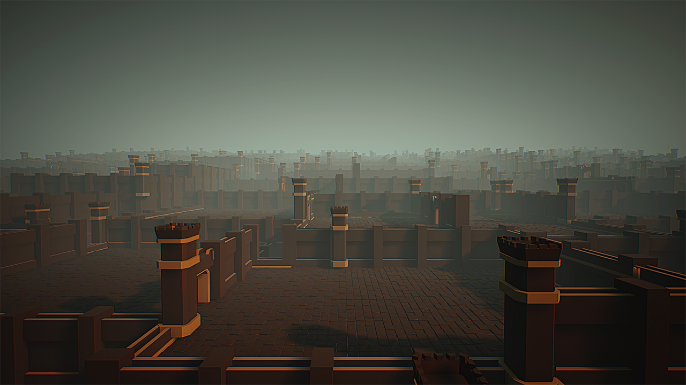

# A sample of code for Arcane Board game

# Features
- Procedural generation of medium-sized city with different regions and levels
- Simple interaction, event and combat system 
- Grid based movement system with A* Pathfiding

# Demonstration
  
